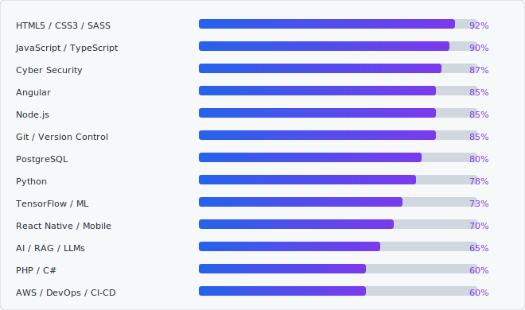

<!-- ╔══════════════════════════════════════════════════════════════╗ -->
<!-- ║   HEADER — mirrors leonmatota.com (blue→violet #2563EB→#7C3AED)║ -->
<!-- ╚══════════════════════════════════════════════════════════════╝ -->

 

 

<!-- ╔══════════════════════════════════════════════════════════════╗ -->
<!-- ║                          ABOUT                               ║ -->
<!-- ╚══════════════════════════════════════════════════════════════╝ -->

## 👋 About Me

> I'm a **full-stack developer** passionate about building user-centric digital solutions — here I share
> my coding journey, documenting both the challenges I face and the solutions I discover.

- 🏦  History in the **banking & FinTech** industry — ATM support, queue management & SMS gateway systems
- 🎓  BSc & Honours in Informatics (**NUST**) · currently pursuing my **Master's in Informatics**
- 🏢  Founder at **LeoDynamics Group (PTY) LTD** · based in **Windhoek, Namibia** 🇳🇦

 

<!-- ╔══════════════════════════════════════════════════════════════╗ -->
<!-- ║                     WHAT I DO (services)                     ║ -->
<!-- ╚══════════════════════════════════════════════════════════════╝ -->

## 💼 What I Do

<table style="width:100%;table-layout:fixed;">
  <tr>
    <td align="center" style="width:25%;padding:16px 8px;">🎨 <b>UI/UX Design</b> Creating intuitive and user-friendly interfaces</td>
    <td align="center" style="width:25%;padding:16px 8px;">🌐 <b>Web Development</b> Building responsive and modern web applications</td>
    <td align="center" style="width:25%;padding:16px 8px;">⚙️ <b>Software Engineering</b> Developing scalable software solutions</td>
    <td align="center" style="width:25%;padding:16px 8px;">📱 <b>Mobile Applications</b> Creating cross-platform mobile experiences</td>
  </tr>
</table>

 

<!-- ╔══════════════════════════════════════════════════════════════╗ -->
<!-- ║            TECH STACK — clean flat Devicon/Iconify logos     ║ -->
<!-- ╚══════════════════════════════════════════════════════════════╝ -->

## 🛠️ Tech Stack

<table>
  <tr>
    <td align="right" width="130"><b>Languages</b></td>
    <td align="center" width="50"></td>
    <td align="center" width="50"></td>
    <td align="center" width="50"></td>
    <td align="center" width="50"></td>
    <td align="center" width="50"></td>
    <td align="center" width="50"></td>
    <td align="center" width="50"></td>
  </tr>
  <tr>
    <td align="right"><b>Frontend</b></td>
    <td align="center"></td>
    <td align="center"></td>
    <td align="center"></td>
    <td align="center"></td>
    <td align="center"></td>
    <td align="center"></td>
    <td></td>
  </tr>
  <tr>
    <td align="right"><b>Backend &amp; Mobile</b></td>
    <td align="center"></td>
    <td align="center"></td>
    <td align="center"></td>
    <td align="center"></td>
    <td></td><td></td><td></td>
  </tr>
  <tr>
    <td align="right"><b>Databases</b></td>
    <td align="center"></td>
    <td align="center"></td>
    <td align="center"></td>
    <td align="center"></td>
    <td></td><td></td><td></td>
  </tr>
  <tr>
    <td align="right"><b>Cloud &amp; Tools</b></td>
    <td align="center"></td>
    <td align="center"></td>
    <td align="center"></td>
    <td align="center"></td>
    <td align="center"></td>
    <td></td><td></td>
  </tr>
  <tr>
    <td align="right"><b>AI &amp; Data</b></td>
    <td align="center"></td>
    <td align="center"></td>
    <td align="center"></td>
    <td></td><td></td><td></td><td></td>
  </tr>
</table>

 

<!-- ╔══════════════════════════════════════════════════════════════╗ -->
<!-- ║                 SKILLS (mirrors site skill bars)             ║ -->
<!-- ╚══════════════════════════════════════════════════════════════╝ -->

## 📈 Skills

 

<!-- ╔══════════════════════════════════════════════════════════════╗ -->
<!-- ║        GITHUB STATS — light cards, blue+violet accents       ║ -->
<!-- ╚══════════════════════════════════════════════════════════════╝ -->

## 📊 GitHub Analytics

 

 

<!-- Contribution snake — auto-generated by .github/workflows/snake.yml -->
<picture>
  <source media="(prefers-color-scheme: dark)" srcset="https://raw.githubusercontent.com/codezilla91/codezilla91/output/github-contribution-grid-snake-dark.svg" />
  <source media="(prefers-color-scheme: light)" srcset="https://raw.githubusercontent.com/codezilla91/codezilla91/output/github-contribution-grid-snake.svg" />
  
</picture>

 

<!-- ╔══════════════════════════════════════════════════════════════╗ -->
<!-- ║                    STACK OVERFLOW (verified)                 ║ -->
<!-- ╚══════════════════════════════════════════════════════════════╝ -->

<!-- ╔══════════════════════════════════════════════════════════════╗ -->
<!-- ║                          FOOTER                              ║ -->
<!-- ╚══════════════════════════════════════════════════════════════╝ -->

